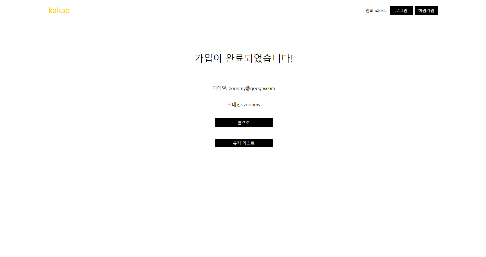
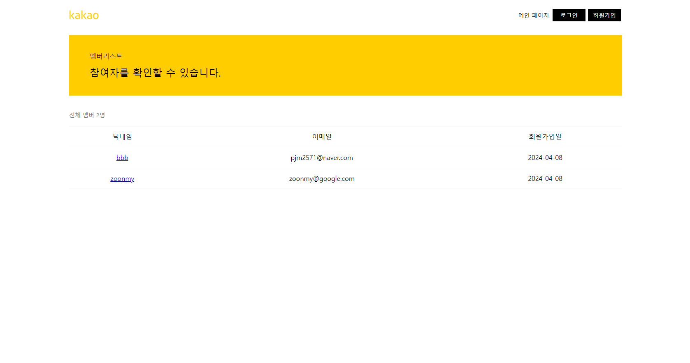
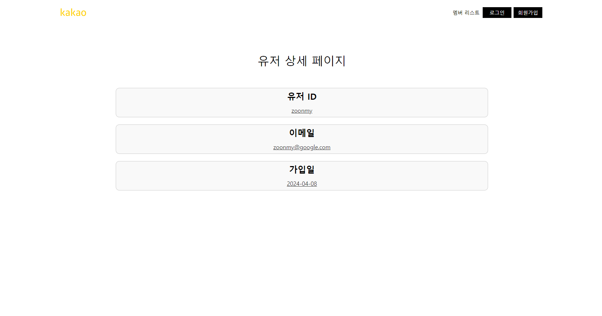

# be-spring-cafe
2024 마스터즈 백엔드 스프링 카페

---

# 📜 URL Convention

| URL                      | 기능                             | 구현 상태 |
|:-------------------------|:-------------------------------|:-----:|
| GET /users               | 회원가입을 할 수 있는 폼을 보여준다           |  ⭕️   |
| POST /users              | 입력된 폼을 가지고, 회원 가입을 수행한다        |  ⭕️   |
| GET /users/list          | 회원가입된 유저들을 보여준다.               |  ⭕️   |
| GET /users/:userId       | useeId에 해당하는 profile을 보여준다     |  ⭕️   |
| GET /articles            | 게시물 입력하는 폼을 보여준다               |  ⭕️   |
| POST /articles           | 입력한 폼을 POST 요청으로 보낸다           |  ⭕️   |
| GET /articles/:articleId | articleId에 해당하는 게시물 상세정보를 보여준다 |  ⭕️   |
| GET /                    | 등록된 모든 qna를 보여준다               |  ⭕️   |

---

# 회원가입 프로그램 동작

## 회원가입
### 1) ```localhost:8080/users``` 로 접속


### 2) 회원가입 폼 작성 후, 회원가입 성공 화면


### 3) 회원가입한 유저들 목록 확인


### 4) 유저 상세 정보 확인


---


# 구현 기능

## Mustache를 사용하여 중복 html 제거
- ```templates```에 있는 html 파일들의 nav 부분이 중복된다.
    - 또한, 추후에 로그인이 되었을 경우와 안되었을 경우를 분리하기 위해 ```mustache 부분 템플릿```이 필요
- ```/templates/base``` 폴더에 html 파일을 생성
    - ```application.properties```에 suffix를 .html로 해놓았기 때문에, base 폴더의 부분 템플릿 확장자는 ```.html```로 구현
### mustache 부분 템플릿 사용법
- ```navBarNav.html```
```html
<ul class="nav navbar-nav navbar-right">
    <li class="active"><a href="/users/list">멤버 리스트</a></li>
    <li><a class="black-component" href="/users/login" role="button">로그인</a></li>
    <li><a class="black-component" href="/users" role="button">회원가입</a></li>
</ul>
```
- 위의 내비바 html을 적용하고자 하는 html에 주입한다.

- ```form.html```
```html
 <nav class="navbar navbar-fixed-top header">
      <div class="col-md-12">
          {{> /base/navBarHeader}}  
          {{> /base/navBarNav}} <!--해당 부분-->
      </div>
</nav>
```
- {{> 파일경로/파일이름}} 을 통해 html 요소를 넣어주어 html 중복 분리

## ```VO, DTO```객체의 사용 대신 ```Data```객체로 다루자!
- 아직 헷갈리는 용어 대신에, ```UserData```, ```ArticleData```객체로 request값을 갖도록 수정
