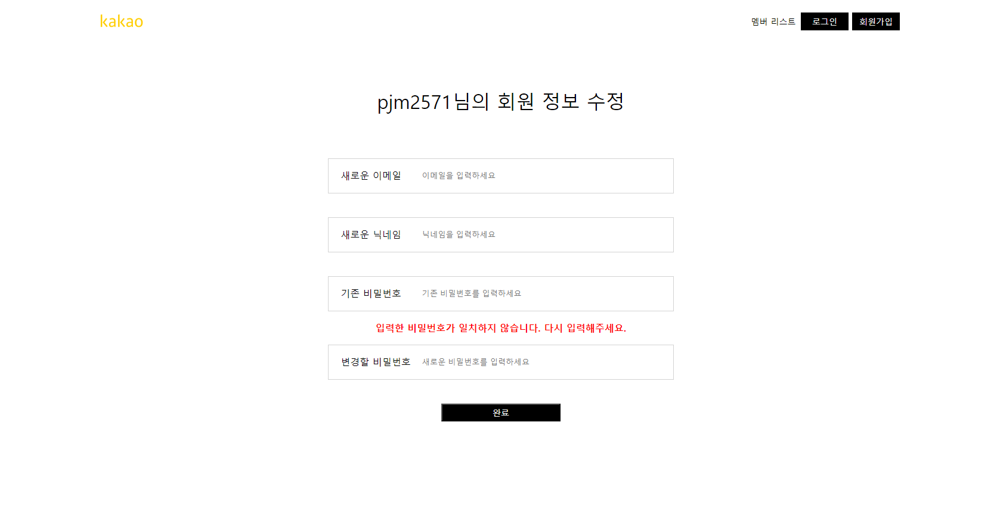

# be-spring-cafe

2024 마스터즈 백엔드 스프링 카페

---

# 📜 URL Convention

| URL                          | 기능                             | 구현 상태 |
|:-----------------------------|:-------------------------------|:-----:|
| GET / , GET /main            | 등록된 모든 게시글들을 보여준다              |  ⭕️   |
| GET /users                   | 회원가입된 유저들을 보여준다.               |  ⭕️   |
| POST /users                  | 입력된 폼을 가지고, 회원 가입을 수행한다        |  ⭕️   |
| GET /users/login             | 로그인 페이지를 보여준다                  |  ⭕️   |
| GET /users/join              | 유저 회원가입 폼을 보여준다                |  ⭕️   |
| GET /users/{{userId}}        | userId에 해당하는 profile을 보여준다     |  ⭕️   |
| GET /users/{{userId}}/form   | userId에 해당하는 수정 페이지를 보여준다      |  ⭕️   | 
| PUT /users/{{userId}}/update | 사용자의 정보를 업데이트                  |  ⭕️   |
| GET /articles/write          | 게시물 입력하는 폼을 보여준다               |  ⭕️   |
| POST /articles               | 입력한 폼을 POST 요청으로 보낸다           |  ⭕️   |
| GET /articles/{{articleId}}  | articleId에 해당하는 게시물 상세정보를 보여준다 |  ⭕️   |

---

# 프로그램 동작

## 회원가입

### 1) ```localhost:8080/users/join```로 접속


### 2) 회원가입된 목록 조회


---

## 회원 정보 상세 페이지

### 1) 유저 아이디를 클릭하여 접속


### 2) 존재하지 않는 유저 경로로 접속했을 경우


> 

---

## 회원 정보 수정

### 1) 수정하기 버튼을 클릭


### 2) 정보들을 입력하여 수정

- 아이디는 수정되지 않음
  

### 3) 등록된 유저 정보와 다른 비밀번호를 입력했을 경우


> 

- 기존 PW : 123
- 수정 페이지에서 입력한 PW : 1234

> 

- 에러 로그가 뜨는 것을 볼 수 있다.

### 4) 성공적으로 업데이트


> 
---

## 글쓰기

### 1) ```localhost:8080/articles```로 접속


### 2) 글 작성 후, 메인 화면 리다이렉션

- 최신 작성한 글이 가장 상단에 보인다


### 3) 제목을 눌러 상세 페이지 확인

- 제목, 내용, 작성자, 작성 시간 표시
    - 작성자 : default로 "작성자" 가 들어간다.
        - 로그인 기능 구현 후 수정 예정


---

# 구현한 기능

## Mustache를 사용하여 중복 html 제거

- ```templates```에 있는 html 파일들의 nav 부분이 중복된다.
    - 또한, 추후에 로그인이 되었을 경우와 안되었을 경우를 분리하기 위해 ```mustache 부분 템플릿```이 필요
- ```/templates/base``` 폴더에 html 파일을 생성
    - ```application.properties```에 suffix를 .html로 해놓았기 때문에, base 폴더의 부분 템플릿 확장자는 ```.html```로 구현

### mustache 부분 템플릿 사용법

- ```navBarNav.html```

```html

<ul class="nav navbar-nav navbar-right">
    <li class="active"><a href="/users/list">멤버 리스트</a></li>
    <li><a class="black-component" href="/users/login" role="button">로그인</a></li>
    <li><a class="black-component" href="/users" role="button">회원가입</a></li>
</ul>
```

- 위의 내비바 html을 적용하고자 하는 html에 주입한다.

- ```form.html```

```html

<nav class="navbar navbar-fixed-top header">
    <div class="col-md-12">
        {{> /base/navBarHeader}}
        {{> /base/navBarNav}} <!--해당 부분-->
    </div>
</nav>
```

- {{> 파일경로/파일이름}} 을 통해 html 요소를 넣어주어 html 중복 분리

---

## ```VO, DTO```객체의 사용 대신 ```Data```객체로 다루자!

- 아직 헷갈리는 용어 대신에, ```UserData```, ```ArticleData```객체로 request값을 갖도록 수정

---

## ```@Configuration``` 과 ```WebMvcConfigurer```을 사용하여 URL과 HTML 매핑

- ```회원가입 페이지```, ```로그인 페이지```, ```게시글 작성 페이지```의 경우에는 동적으로 생성해주지 않고, 정적으로 생성해주어도 된다.
    - 따라서, 굳이 ```Controller```을 통해 ```@GetMapping```을 해 줄 필요가 없다!

### ```WebMvcConfigurer``` 인터페이스를 통해 구현

- 컨트롤러 클래스 없이, 특정 view에 대한 컨트롤러를 추가할 수 있다!
- ```addViewControllers(ViewControllerRegistry registry)```메소드를 오버라이딩!

```java

@Configuration
public class MvcConfig implements WebMvcConfigurer {
    @Override
    public void addViewControllers(ViewControllerRegistry registry) {
        /* Main Redirect */
        registry.addRedirectViewController("/", "main");    // URL에 /을 입력하면 항상 /main 으로 접속된다
        registry.addRedirectViewController("/articles", "main");    // URL에 /articles을 입력하면 /main 으로 접속된다


        /* User */
        registry.addViewController("/users/join").setViewName("user/form"); // 유저 회원가입
        registry.addViewController("/users/login").setViewName("user/login");   // 유저 로그인

        /* Article */
        registry.addViewController("/articles/write").setViewName("article/form");  // 게시글 작성

        /* 우선순위를 가장 높게 설정 */
        registry.setOrder(Ordered.HIGHEST_PRECEDENCE);
    }
}

```

- ```registry.addRedirectViewController(접속 URL, 리다이렉트 URL);```
    - 접속 URL로 접속하면, 항상 리다이렉트 URL로 접속
- ``` registry.addViewController(접속 URL).setViewName(보여줄 HTML 경로);```
    - 접속 URL로 접속하면,보여줄 HTML 경로를 보여준다.
    - 이를 통해 Controller 없이도 정적 페이지 제공 가능

---

## Custom Exception 구현

### 사용자를 못찾은 경우 : ```UserNotFoundException```

- UserManagementService에서 예외를 던진다.
    - 예외를 처리하는 ```ExceptionController```를 구현
        - ```/error/ErrorController```

### 사용자의 비밀번호가 틀린 경우 : ```PasswordMisMatchException```

---