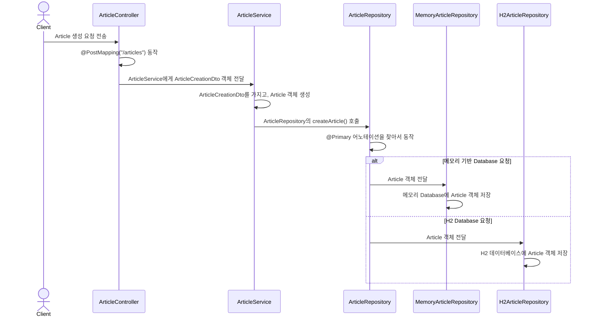
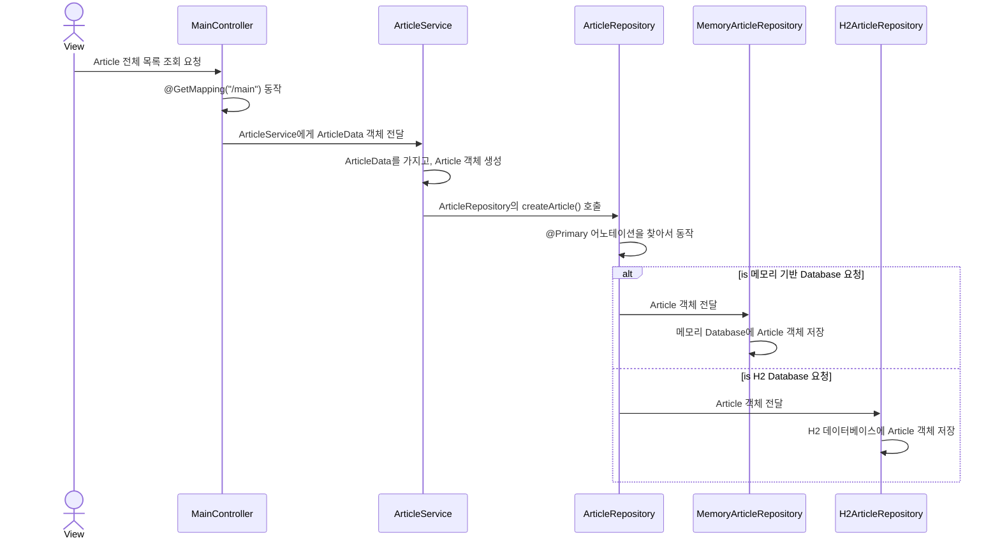

# Article 생성

```mermaid
sequenceDiagram
    actor A as Client
    participant B as ArticleController
    participant C as ArticleService
    participant D as ArticleRepository
    participant E as MemoryArticleRepository
    participant F as H2ArticleRepository
    
    A ->> B : Article 생성 요청 전송
    B ->> B : @PostMapping("/articles") 동작
    B ->> C : ArticleService에게 ArticleCreationDto 객체 전달
    C ->> C : ArticleCreationDto를 가지고, Article 객체 생성
    C ->> D : ArticleRepository의 createArticle() 호출
    D ->> D : @Primary 어노테이션을 찾아서 동작
    alt 메모리 기반 Database 요청
        D ->> E : Article 객체 전달
        E ->> E : 메모리 Database에 Article 객체 저장
    else H2 Database 요청
        D ->> F : Article 객체 전달
        F ->> F : H2 데이터베이스에 Article 객체 저장
    end
    
```

# Article 전체 조회

```mermaid
sequenceDiagram
    actor A as View
    participant B as MainController
    participant C as ArticleService
    participant D as ArticleRepository
    participant E as MemoryArticleRepository
    participant F as H2ArticleRepository
    
    A ->> B : Article 전체 목록 조회 요청
    B ->> B : @GetMapping("/main") 동작
    B ->> C : ArticleService에게 ArticleData 객체 전달
    C ->> C : ArticleData를 가지고, Article 객체 생성
    C ->> D : ArticleRepository의 createArticle() 호출
    D ->> D : @Primary 어노테이션을 찾아서 동작
    alt is 메모리 기반 Database 요청
        D ->> E : Article 객체 전달
        E ->> E : 메모리 Database에 Article 객체 저장
    else is H2 Database 요청
        D ->> F : Article 객체 전달
        F ->> F : H2 데이터베이스에 Article 객체 저장
    end
    
```