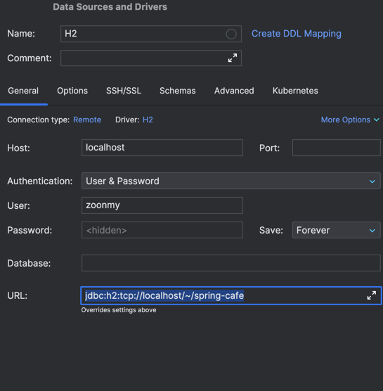
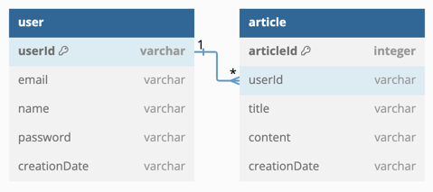

스프링 카페 - DB에 저장하기 [Step-3]
===

# ✅ 구현 사항 체크리스트

## 1) H2 데이터베이스 연동

- [x] h2 데이터베이스 의존성 추가하기
- build.gradle
```
implementation 'org.springframework.boot:spring-boot-starter-jdbc:3.2.4'
implementation 'com.h2database:h2:1.4.200'
```
- [x] Spring JDBC 사용하기
- application.properties
```
spring.datasource.driverClassName=org.h2.Driver
spring.datasource.url=jdbc:h2:~/spring-qna-db;DB_CLOSE_ON_EXIT=FALSE
spring.datasource.username=zoonmy
spring.datasource.password=zoonmy

spring.h2.console.enabled=true
spring.h2.console.path=/h2-console
```
- [x] Intellij에 h2 db 연결하기


- [ ] User, Article 테이블 생성하기
- USERS 테이블 생성
```
CREATE TABLE USERS (
    userId VARCHAR(255) PRIMARY KEY,
    email VARCHAR(255),
    name VARCHAR(255),
    password VARCHAR(255),
    creationDate VARCHAR(255)
);
```
- ARTICLES 테이블 생성
```
CREATE TABLE ARTICLES (
      articleId INT AUTO_INCREMENT PRIMARY KEY,
      userId VARCHAR(255),
      title VARCHAR(255),
      content VARCHAR(255),
      creationDate VARCHAR(255), -- creationDate를 DATE 타입으로 변경
      FOREIGN KEY (userId) REFERENCES USERS(userId)
);
```


## 2) 게시글 데이터 저장하기
- [x] Article 클래스를 DB 테이블에 저장하기
- [x] Article 클래스 PK, FK 작성하기
  - PK : articleId
  - FK : userId

## 3) 게시글 목록 구현하기
- [x] 전체 게시글 목록 데이터를 DB에서 조회하도록 구현
- [x] Repository Interface 적용해보기
- [x] @Primary 어노테이션 사용해보기

## 4) 게시글 상세보기 구현하기
- [x] 게시글 세부 내용을 DB에서 가져오도록 구현한다
- [ ] 게시글 상세보기를 할 때, 조회수가 증가하도록 구현해본다
- [ ] Article 객체에 조회수를 담는 변수를 추가한다
  - Artciel Table에 추가를 할 지, 다른 테이블에 추가를 할 지 고민해보자

## 5) 사용자 정보 DB에 저장
- [x] User 클래스를 DB 테이블에 저장하기

---

# DB 모델링하기


### ```Article```의 ```userId``` 를 ```외래키 [FK]```로 설정!
### ```User```에 하나의 ```userId```에 많은 수의 ```Article```이 올 수 있다.
- Many To One

--- 

# ```Service``` & ```Repository``` 사용하기
- H2 데이터베이스와의 연동을 구현하면서, 구조가 복잡해지고, 비밀번호 검증과 같은 과정이 추가되면서, Controller에서 모든 것을 처리해주기는 복잡해 보였다.
- 또한, ```Memory DB```와 ```H2 DB```를 상황에 따라 사용하고 싶었다.

## ```Repository Interface``` - ```Repository 구현체```
- Repository Interface를 구현해놓고, ```H2```, ```Memory```상황에 따라 다르게 동작하도록 구현한다.
- ```@Repository``` 어노테이션으로 통해 동작하게 할 수 있다.
  - 또한, ```@Primary```을 통해 어떤 것을 쓸 것인지 bean에 등록할 수 있다.

## 🤯 고민
- ```UserData```라는 객체를 ```User``` 객체로 만들어주는 메소드가 존재한다.
  - ```Controller```에서 ```User```객체를 만드는 것이 좋을까?
  - ```Service```에서 ```User```객체를 만드는 것이 좋을까?
- 에 대해서 고민하였다.

## 🔍 고민에 대한 구현
- ```Service```단에서 UserData를 가지고 User 객체를 생성하는 방법을 선택하였다.
### 생각했던 이점
- **단일 책임 원칙** : 컨트롤러는 클라이언트의 요청을 받고 응답 반환 역할 담당. 따라서, 데이터 변환 작업은 ```Service```계층이 적합하다.
- **재사용성** : 변환하는 로직을 Controller에서 사용하는 것 보다, 서비스 계층에 위치시켜 다른곳에서 재사용을 쉽게 한다.
- **유연성** : 서로 다른 DTO와 Entity 사이의 변환 로직을 동적으로 선택하는 경우 생각

