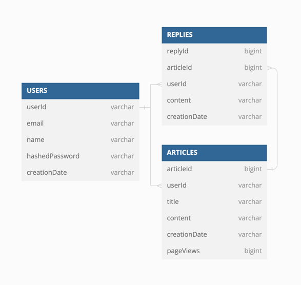

스프링 카페 - 댓글 기능 구현 [STEP-6]
===

# ✅ 구현 사항 체크리스트

## 1) 댓글을 담당하는 클래스 ```Reply``` 클래스 구현

- [X] ```Reply``` 테이블 생성
    - ```replyId``` : AutoIncrement로 구현 **[PK]**
    - ```articleId``` : ```Articles``` 테이블의 ```articleId [PK]```를 가진다 **[FK]**
    - ```userId``` : ```Users``` 테이블의 ```userId [PK]``` 를 가진다 **[FK]**
    - ```content``` : 댓글 내용을 담고 있는 필드
    - ```creadtionDate``` : 댓글이 작성된 시간을 담고 있는 필드

```
CREATE TABLE REPLIES (
    replyId      LONG AUTO_INCREMENT PRIMARY KEY,
    articleId    LONG,
    userId       VARCHAR(255),
    comment      VARCHAR(255),
    creationDate VARCHAR(255), -- creationDate를 DATE 타입으로 변경
    FOREIGN KEY (userId) REFERENCES USERS (userId),
    FOREIGN KEY (articleId) REFERENCES ARTICLES (articleId)
);
```



## 2) 게시글 접속 시, 해당 게시물에 연결되어있는 모든 댓글들을 보이게 구현

- [x] ```Articles```테이블의 ```articleId```에 종속되어있는 모든 ```Reply``` 레코드들을 보여주게 구현
    - 작성자 ```userId```가 보여야 한다
    - 작성 내용 ```content```가 보여야 한다
    - 작성 시간 ```creationDate```가 보여야 한다

## 3) 게시글 접속 시, 댓글 작성 폼에 ```작성자 id```를 보여준다.

- [x] 댓글을 작성할 떄에는, 내용만 작성할 수 있다.
    - 작성자 란은 ```sessionedUser```값의 ```userId``` 필드를 이용한다.

---

# 추가 구현

## 1) 게시글 데이터를 ```Soft Delete```으로 구현하기

### ```Soft Delete```와 ```Hard Delete```의 차이?

- ```Soft Delete``` : 논리적 삭제
    - SQL의 UPDATE 명령을 사용하여 삭제 여부를 알 수 있는 ```Column```에 데이터가 삭제되었다는 ```값```을 넣어서 표현
- ```Hard Delete``` : 물리적 삭제
    - SQL의 DELETE 명령어를 사용하여 직접 데이터를 삭제하는 방법

### ```Articles``` 테이블 수정

- ```deleted``` column 추가

```
CREATE TABLE ARTICLES (
      articleId LONG AUTO_INCREMENT PRIMARY KEY,
      userId VARCHAR(255),
      title VARCHAR(255),
      content VARCHAR(255),
      creationDate VARCHAR(255), -- creationDate를 DATE 타입으로 변경
      pageViews LONG,
      deleted BOOLEAN,  // 추가된 부분
      FOREIGN KEY (userId) REFERENCES USERS(userId)
);
```

### ```H2ArticleRepository``` 수정

- INSERT 수행 시, ```DELETED```값이 ```FALSE```로 저장되도록 구현

```java

@Override
public void createArticle(Article article) {
    String sql = "INSERT INTO ARTICLES (USERID, TITLE, CONTENT, CREATIONDATE, PAGEVIEWS, DELETED) VALUES (?, ?, ?, ?, ?, false)";
    jdbcTemplate.update(sql, article.getUserId(), article.getTitle(), article.getContent(), article.getCreationDate().toString(), article.getPageViews());
    logger.debug("Article Title : '{}' Updated At H2 Database", article.getTitle());
}
```

- SELECT 수행 시, ```DELETED``` 값이 ```FALSE```인 것들만 가져오도록 구현

```java

@Override
public Optional<ArrayList<Article>> getAllArticles() {
    String sql = "SELECT ARTICLEID, USERID, TITLE, CONTENT, CREATIONDATE, PAGEVIEWS FROM ARTICLES WHERE DELETED = FALSE";
    ArrayList<Article> articles = (ArrayList<Article>) jdbcTemplate.query(sql, new ArticleRowMapper());
    Collections.reverse(articles);
    return Optional.of(articles);
}
```

---

## 2) 게시글 삭제 경우 구현하기

### 삭제 가능한 경우

- 게시글에 댓글이 없는 경우
- 게시글에 댓글이 있지만, 작성자가 게시글 작성자와 같은 경우

### 삭제 불가능한 경우

- 게시글에 작성자가 게시글 작성자와 다른 댓글이 하나라도 있는 경우

## 3) 게시글 삭제 시, 댓글도 삭제되게 구현하기

- DELETE 시, cascade 옵션을 주면 된다.

- 하지만, ```DELETED``` 필드를 사용해야 한다.
    - ```DELETE``` 명령이 아닌 ```UPDATE``` 명령이 필요

> articleRepository.deleteArticle(articleId) 에서 article과 reply를 같이 삭제

```java

@Override
public void deleteArticle(long articleId) {
    String articleDeleteSql = "UPDATE ARTICLES SET DELETED = TRUE WHERE ARTICLEID = ?";

    jdbcTemplate.update(articleDeleteSql, articleId);

    String replyDeleteSql = "UPDATE REPLIES SET DELETED = TRUE WHERE ARTICLEID = ?";

    jdbcTemplate.update(replyDeleteSql, articleId);
}
```

---

# 🛠️ 구현 사항 리팩토링

## 기존 상황

기존 프로젝트에서는, 로그인하지 않은 상태와 로그인 한 상태에 따라 기능이 제한적으로 수행되는 URL이 있었다.

- ```/users/join``` [회원가입 url]
    - 로그인 한 상태 : 접근 불가
    - 로그인 하지 않은 상태 : 접근 가능

### 문제 상황

- 권한에 대한 확인을 컨트롤러 단에서 해주었다.
- 그러다 보니, Controller 단에서 중복되는 코드가 많이 발생
```java
@DeleteMapping("/delete/{articleId}")
public String deleteArticle(@PathVariable long articleId, HttpServletRequest request, Model model) {
    Article article = articleService.findArticleById(articleId);

    /* 중복되는 부분 */
    HttpSession session = request.getSession();
    UserPreviewDto userPreviewDto = (UserPreviewDto) session.getAttribute("sessionedUser");

    if (!userPreviewDto.getUserId().equals(article.getUserId())) {
        throw new UserAccessException("게시물에 대한 접근 권한이 없습니다.");
    }
    /* ------- */
  
    articleService.deleteArticle(articleId);

    return "redirect:/";
}


@GetMapping("/update/{articleId}")
public String showArticleUpdatePage(@PathVariable long articleId, HttpServletRequest request, Model model) {
    Article article = articleService.findArticleById(articleId);

    /* 중복되는 부분 */
    HttpSession session = request.getSession();
    UserPreviewDto userPreviewDto = (UserPreviewDto) session.getAttribute("sessionedUser");
  
    if (!userPreviewDto.getUserId().equals(article.getUserId())) {
      throw new UserAccessException("게시물에 대한 접근 권한이 없습니다.");
    }
    /* ------- */ 
  
    model.addAttribute("article", article);
    return "article/updateForm";
}
```

### 문제 개선
- ```Spring AOP``` vs ```Spring Interceptor```
> Spring Interceptor는 ```DispatcherServlet```이 ```Controller```를 호출하기 전, 후로 끼어들어서 Spring Context 내부에서 ```Controller```에 관한 ```Request```, ```Response```를 처리

> 또한, 파라미터로 ```HttpServletRequest```, ```HttpServletResponse```를 사용하여 Controller로 넘어가기 때문에 처리하기 용이하다고 생각!

- In 토비의 스프링...
> 컨트롤러의 호출 과정에 적용되는 부가 기능은 핸들러 인터셉터를 사용하는 편이 낫다. 스프링 MVC의 컨트롤러는 타입이 하나로 정해져 있지 않고, 실행 메소드 또한 제각각이기 때문에 적용할 메소드를 선별하는 포인트컷 작성도 쉽지 않다. 게다가 파라미터나 리턴 값 또한 일정치 않다. 이러한 이유러 컨트롤러에 AOP를 적용하려면 꽤나 많은 수고가 필요하다. 반대로 스프링 MVC는 모든 종류의 컨트롤러에게 동일한 핸들러 인터셉터를 적용할 수 있게 해준다. 따라서 컨트롤러에 공통적으로 적용할 부가기능이라면 핸들러 인터셉터를 이용하는 편이 낫다.

