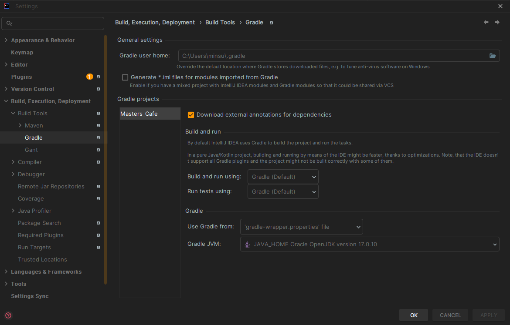

스프링 카페 - ajax 댓글 구현 [STEP-7]
===

# ✅ 구현 사항 체크리스트

## 1) 댓글 기능 AJAX로 구현

> RestController와 AJAX로 댓글을 구현

- [ ] RestController 학습하기
- [ ] 학습 내용을 바탕으로 기존 ```Controllerr``` 어노테이션 태그를 ```RestController```태그로 리팩토링하기
- [ ] html 페이지에서 ajax 통신을 보내는 법 학습하기
- [ ] ajax 통신을 통해서 서버 단으로 ```JSON``` 데이터 보내기
- [ ] 자바에서 ```JSON```데이터를 파싱하는 방법 학습하기
- [ ] 학습 내용을 기반으로 ```View```에서 보낸 ```JSON``` 데이터를 ```SpringBoot```에서 파싱하여 데이터화하기
- [ ] 파싱한 데이터를 가지고, ```jdbcTemplate```을 이용하여 ```H2 Database```에 저장하기

## 2) 댓글 삭제 기능 AJAX로 구현

- [ ] 위의 구현 내용을 바탕으로 댓글 삭제 기능도 구현한다

## 3) 데이터베이스 변경

- [ ] 기존 ```H2``` 데이터베이스를 ```MySql 8.x``` 버전으로 변경한다
- [ ] 그렇게 되면, SQL 문도 수정이 필요할 수 있다. 수정이 필요하면 수정하자

## 4) AWS EC2로 배포하기

- [ ] RDS는 사용하지 않는다
- [ ] 배포 IP를 README에 기술
- [ ] 데이터베이스와 스프링의 인스턴스 분리 해보기
    - DB와 스프링 서버를 분리하는 방법도 생각해본다.

---

# ```RestController``` 학습

## ```@RestController```와 ```@Controller```의 차이

### ```@Controller```의 역할

**[1] ```View를 반환```하기 위해 사용**


> 1) Client ➡️ 웹 서비스에 요청 [URI 형식]
> 2) DispatcherServlet이 요청을 처리할 대상 찾음
> 3) HandlerAdapter을 통해 Controller로 위임
> 4) Controller ➡️ 요청 처리 ➡️ ViewName 반환
> 5) DispatcherServlet은 ViewResolver를 통해 ViewName에 해당하는 View를 찾아 사용자에게 반환

**[2] ```Data를 반환``` 하기 위해 사용**

- 데이터를 반환하기 위해 ```@ResponseBody``` 어노테이션을 활용
- 이를 통해 Controller에서도 ```JSON``` 형태로 데이터 반환 가능
  

> 1) Client ➡️ 웹 서비스에 요청 [URI 형식]
> 2) DispatcherServlet이 요청을 처리할 대상 찾음
> 3) HandlerAdapter을 통해 Controller로 위임
> 4) Controller ➡️ 요청 처리 ➡️ 객체 반환
> 5) 반환되는 객체는 Json으로 Serialize되어 사용자에게 반환

### ```@RestController```의 역할
- ```Controller```와 ```ResponseBody```가 합쳐진 어노테이션
- ```@Controller```와 다르게 반환하는 주류는 ```JSON``` 형태의 객체 데이터


