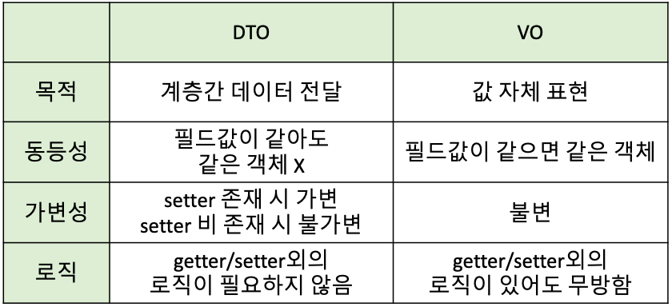

스프링 카페 - 학습 정리
===

# 🔎 REST API

- REST API는 HTTP 요청을 통해 통신함으로써 리소스 내에서 레코드(CRUD 라고도 함)의 작성, 읽기, 업데이트 및 삭제 등의 표준 데이터베이스 기능을 수행
    - ```GET``` 요청 : 레코드 검색
    - ```POST``` 요청 : 레코드 작성
    - ```PUT``` 요청 : 레코드 업데이트
    - ```DELETE``` 요청 : 레코드 삭제
- 이러한 기능들 ```CRUD```라고 한다.

```java

@RestController
public class WebRestController {
    @GetMapping("/hello")
    public String hello() {
        return "HelloWorld!";
    }
}
```

- 해당 요청은 ```GET```요청을 통해 레코드를 검색!

---

# 🔎 ```@AutoWired```

- 알아서 의존 객체(Bean)을 찾아서 주입한다
- ```의존성``` : 하나의 객체 내에서 다른 객체를 사용하는 경

> ```UserController```에서 ```UserService```객체를 호출하여 ```User``` 객체를 생성하고, 저장하는 역할을 하게 한다.

## 의존성 주입을 하는 이유?

- Test가 용이해진다.
- 코드의 재사용성을 높여준다.
- 객체 간의 의존성(종속성)을 줄이거나 없앨 수 있다.
- 객체 간의 결합도를 낮추면서 유연한 코드를 작성할 수 있다.

## 의존성 주입 방법 [3가지]

### [1] 생성자 주입 (Constructor Injection)

```java

@Controller
public class MyController {

    private final MyService myService;

    @AutoWired  // 주입받을 객체가 빈으로 등록되어 있다면, 생략이 가능하다.
    public MyController(MyService myService) {
        this.myService = myService;
    }
}
```

- 주입받을 객체 ```MyService```

```java

@Service    // Annotation을 통해 Bean으로 등록되어있는 상태!
public class MyService {...
}
```

### [2] 필드 주입 (Field Injection)

```java

@Controller
public class MyController {

    @AutoWired
    private MyService myService;
}
```

- 필드에 @Autowired 어노테이션만 붙여주면 자동으로 의존성 주입
- 단점
    - 코드가 간결하지만, 외부에서 변경하기 힘들다.
    - 프레임워크에 의존적이고 객체지향적으로 좋지 않다.

### [3] 수정자 주입 (Setter Injection)

```java

@Controller
public class MyController {
    private MyService myService;

    @AutoWired
    public void setMyService(MyService myService) {
        this.myService = myService;
    }
}
```

- 단점 : 수정자 주입을 사용하면 setXXX 메서드를 public으로 열어두어야 하기 때문에 언제 어디서든 변경이 가능하다.

### 권장되는 방법 : 생성자 주입

- Spring Framwork reference에서 권장하는 방법은 생성자를 통한 주입이므로 이를 활용하자

### [참고 및 출처 사이트 (dev-coco)](https://dev-coco.tistory.com/70)

---

# 🔎 ```VO (Value Object)```

- ```HttpServletRequest```를 사용하던 도중, ```UserVO```를 사용하면 좋다는 피드백이 있어 찾아보았다.

---

# 🔎 ```MVC 구조```

- UserVO, UserService, UserController라는 용어들을 사용하면서, 이 객체들이 하는 역할에 대해 궁금해졌다.

## Controller

> "어떤 서비스에 매칭시켜줄까?"

- 클라이언트 [View] 에서 요청이 들어옴
    - 해당 요청을 수행할 화면 제어
    - 해당 요청을 수행할 비즈니스 로직 [Model] 제어

```모델과 뷰를 연결해 주는 중간다리 역할```

- 컨트롤러는 요청에 따른 처리방식을 결정할 뿐, 실제로 서비스를 수행하는 것은 model 영역!

## Service

> "이 요청을 어떻게 처리할까?"

- Model 영역의 한 종류이다.
- 클라이언트 [View] 에서 들어온 요청에 대한 비즈니스 로직을 처리한다.

```
클라이언트 요청 URL -> Controller : 요청 입력

Controller -> Service : 요청 전달

Service : 로직 수행

Service -> Controller : 요청 처리 결과 반환
```

### @Service 어노테이션을 사용하는 이유?

- @Service어노테이션을 통해 루트 컨테이너에 Bean 객체로 등록하고, 등록된 Bean을 통해스프링은 Controller가 어떤 Service를 호출 할 것인지 결정하는 것이다.
    - 즉, xml에 직접 등록해야하는 것을 대신 해주는 것이다.

### Service Component 구현방법

- Service는 Interface를 활용하여 구현한다.

> 구현 순서
> 1) Service Interface
> 2) Service Interface Implement [Class]

- Interface 사용을 통해, 클래스 간의 결합을 느슨하게 하자!

> 비즈니스 로직이 바뀌었을 경우 Implement만 갈아끼우면 된다!

- View는 생략.. ㅎ

---

# 🔎 ```VO? DTO?``` 차이점

## DTO (Data Transfer Object)

- 순수하게 데이터를 담아 계층 간으로 전달하는 객체
  
- 생성자를 이용한, 불변 객체로 동작하게 하자!

```java
//생성자를 이용한 불변 객체
public class UserDTO {

    private String email;
    private String userId;
    private String password;

    // 생성자를 이용하여 불변 객체로 전달!
    public UserDTO(String email, String userId, String password) {
        this.email = email;
        this.userId = userId;
        this.password = password;
    }

    public String getEmail() {
        return email;
    }

    public String getUserId() {
        return userId;
    }

    public String getPassword() {
        return password;
    }
}
```

## VO (Value Object)

- VO는 값 그 자체를 나태는 객체
- DTO와 반대로 로직을 포함할 수 있으며, VO의 경우 특정 값 자체를 표현하기 때문에 불변성의 보장을 위해 생성자를 사용하여야 한다.
- VO는 서로 다른 이름을 갖는 VO 인스턴스라도 모든 속성 값이 같다면 두 인스턴스는 같은 객체인 것이 핵심

## 차이점 정리



```
목적:

DTO: 데이터 전송에 사용되는 객체로, 주로 서로 다른 시스템 또는 계층간에 데이터를 전달하기 위해 사용됩니다. 주로 데이터베이스나 외부 API와의 통신에서 사용됩니다.
VO: 비즈니스 영역에서 사용되는 객체로, 주로 도메인 모델 내에서 사용됩니다. 객체의 값을 그대로 전달하거나 비즈니스 로직을 수행할 때 사용됩니다.
```

### 결론

- ```UserController```에서 ```UserVO```객체로 ```UserService```에 전달하는 것이 맞다!
    - 왜냐하면, 비즈니스 영역에서 사용되는 객체이기 때문!
- 만약, User 객체가 Database에 저장되어야 한다면, ```DTO```로 사용되야 할 것,,!?

---

# HTML은 왜 POST, GET만 지원할까?

- Step-2 마지막 단계 ```PUT```메소드를 통한 업데이트 를 진행하면서 이와 같은 의문점이 들었다.

> method에 GET, POST 말고 PUT, DELETE를 넘겨주면 되는 거 아니야?

- ```Form```
    - ```Form```은 서버에 정보를 제출하기 위해 존재한다!
        - ```GET``` : form에 있는 정보를 줄테니, 나에게 ```리소스(representation)```을 줘!
        - ```POST``` : form에 있는 정보를 줄테니, ```처리```해줘
- HTML Form은 위와 같은 형식으로 사용된다. 그렇다면, ```DELETE```, ```PUT```은 어떨까
    - ```DELETE``` : 이미 URI는 리소스를 정확하게 식별하고 요청을 보낸다!
        - 따라서, FORM이 필요없다.
    - ```PUT``` : 전송해야 할 것은 리소스를 대체할 representation 그 자체인데, form 데이터를 처리할 필요가 없다!

## POST, GET만 쓰면 되잖아! 왜 PUT, DELETE를 쓰는것일까?

- 사실 그 목적은 ```RESTful```에 있다!

### REST란?

- Representational State Transfer 의 약자!
    - 전송에 대한 표현 이라고 해석할 수 있다.

### REST API 중심규칙 및 구성

> **1) URI는 정보의 자원을 표현!**

- URI는 자원자체를 표현하는데 있어서, get create update와 같이 동사로 표현하지 않고 자원자체의 명사로만 표현
- 사실 가독성에 있어서 동사표현이 편할 수 있겠지만, 이는 Method로 처리하는게 규칙

> **2) 자원에 대한 행위는 HTTP Method로 표현!** 


> ### 따라서, 현재 User 정보를 업데이트 하는 것은 POST가 아닌 PUT 메소드가 적절하다!

---

# JDBC? JDBC Template?
## JDBC
- ```Java Database Connectivity```의 약자
- Java에서 Database에 접속하고 제어하기 위해 사용되는 API
## JDBC Template
- JAVA에서 관계형 데이터베이스에 접근할 수 있다.
- CRUD 동작을 수행할 수 있다.