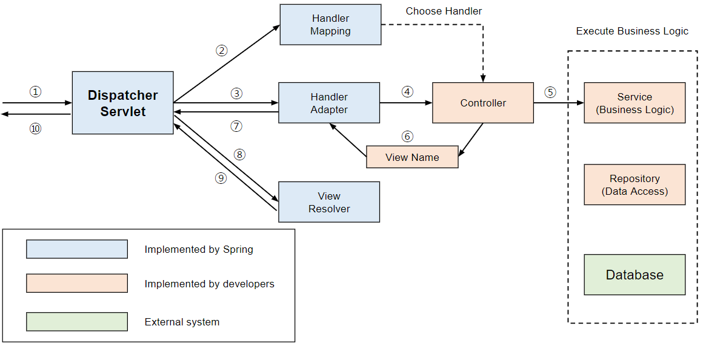

# `@PathVariable` 로 사용중인 변수를 가져오지 못하는 오류

```
java.lang.IllegalArgumentException: Name for argument of type [int] not specified, and parameter name information not available via reflection. Ensure that the compiler uses the '-parameters' flag.
```
Intellij 세팅 중 Gradle - `Build and run using` 설정을 Intellij 로 변경해 실행하니 위 오류 발생

다시 Gradle로 변경하니 정상 작동!



### `-parameters` 옵션

에러 메시지에 나온 `-parameters` 옵션에 대해 알아보던 중, 
`@ModelAttribute` 관련 오류도 같은 방식으로 [해결한 글](https://ppusda.tistory.com/m/78)을 발견

```
java.lang.IllegalStateException: Cannot resolve parameter names for constructor Name(java.lang.Integer,java.lang.Integer)
```

- Additional command line parameters


